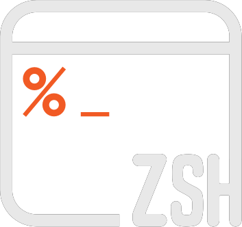

# Hi, I'm Ty! 

<!--Banner-->

 

<left>
  <!--Gmail icon-->
  
  <!--LinkedIn icon-->
  
  <!--Medium icon-->
  
  <!--Twitter icon-->
  
  <!--Kaggle icon-->
  
</left>

## About Me
I'm a passionate Data Engineer with a knack for crafting innovative products and robust data solutions. I specialize in architecting ETL/ELT pipelines that transform data into actionable insights 💡.

- 🧠 Certified in [Data Analytics](https://www.credly.com/badges/a074e774-8783-49d5-a377-7b04b0322f60/public_url), [Data Science](https://www.linkedin.com/posts/tyrellrawls_datascientist-datascience-dataanalytics-activity-6959953402051104769-AKZx?utm_source=share&utm_medium=member_desktop), and [Artificial Intelligence](https://www.linkedin.com/posts/tyrellrawls_datascientist-datascience-dataanalytics-activity-7024871721161641984-e5qD?utm_source=share&utm_medium=member_desktop)
- 🌱 I am currently immersing myself in comprehensive learning about Data Engineering to enrich my skill set
- ⚡ Fun fact: I love to play video games 🎮 👾

## Languages and Tools:

 

 
 

<!-- ## 💼 Technical Skills

 -->

## 📚 Latest Medium Stories
<!-- MEDIUM-STORY-LIST:START -->
- [PostgreSQL Integration with Python: A Simple Guide](https://medium.com/thedeephub/postgresql-integration-with-python-a-simple-guide-34b675e4bffd)
- [Streamlining Data Transfers: Python’s Guide to Amazon S3 Cloud Object Storage](https://medium.com/thedeephub/streamlining-data-transfers-pythons-guide-to-amazon-s3-object-storage-7dc06a2c0f42)
- [Engineering an Advanced ELT Pipeline for Optimizing Stock Portfolios](https://medium.com/@tyrawls/engineering-an-advanced-elt-pipeline-for-optimizing-stock-portfolios-ee8a5d1fa5dc)
<!-- MEDIUM-STORY-LIST:END -->

## ⚡ Github Stats

## 🔥 Github Streaks</b>

